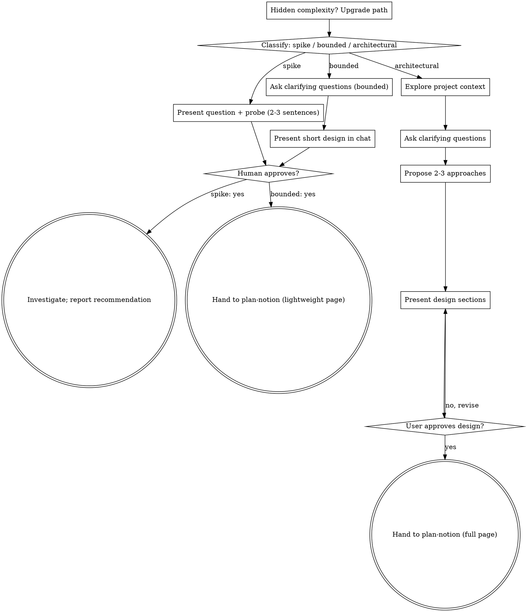

# Brainstorming Ideas Into Designs

## Suis-je la bonne version ?

Le 2026-09-08, une session a chargé le skill `plan-notion` depuis une copie
synchronisée périmée (`~/.claude/remote/plugins/<hash>/`, version 0.3.0 alors
que 0.7.0 était installée) et a travaillé tout un plan sur les mauvaises
règles. N'importe quel skill peut être chargé de la même façon : il ne
choisit pas d'où il vient, il peut seulement le constater.

À vérifier au chargement, en une commande :

```bash
python3 -c 'import json,os;d=json.load(open(os.path.expanduser("~/.claude/plugins/installed_plugins.json")))["plugins"]["methode-de-travail@atelier"][0];print(d["version"],d["installPath"])'
cat "${CLAUDE_PLUGIN_ROOT}/.claude-plugin/plugin.json" | grep '"version"'
```

Les deux versions doivent être identiques, et le chemin annoncé au chargement
(« Base directory for this skill », soit `${CLAUDE_PLUGIN_ROOT}`) doit être
l'`installPath` rendu ci-dessus. Écart → le dire à Benjamin en une ligne, puis
lire ce `SKILL.md` et `_partage/` depuis cet `installPath`, pas depuis la
copie chargée. Pour charger la plus récente : `claude plugin update
methode-de-travail@atelier` (redémarrage requis) ; en session cloud, le
setup script pose déjà la dernière version publiée — jamais plus loin que ce
que `main` du dépôt porte. Ce que cette garde ne règle pas : une copie qui ne
l'embarque pas ne préviendra jamais — elle protège à partir de la version qui
la porte.

Help turn ideas into fully formed designs through natural collaborative dialogue.

Start by classifying how much process the request needs, then work through your
path: understand the context, refine the idea, present a design, and get
approval.

<HARD-GATE>
Do NOT invoke any implementation skill, write any code, scaffold any project, or
take any implementation action until you have told the user what you intend and
they have approved it. This applies to EVERY task on EVERY path below — the
ceremony scales with the task; the approval gate never does.

**Plan-mode exception (Benjamin):** if Claude Code's native plan mode is active,
do not create a Notion page, on any path. The native plan has its own validation
cycle, and two competing plans would make it ambiguous which one is
authoritative. In every other mode, the output of this dialogue routes through
`plan-notion` — see "Où va la sortie" below.
</HARD-GATE>

## Three Paths

Before your first question, classify the request and say the classification out
loud — "this looks bounded, so I'll present a short design here rather than a
full plan" — so the user can override it:

- **Spike** — a feasibility question ("can we...", "is it possible...", "quick
  and dirty is fine") whose output is an answer, not code you keep. Present the
  question and what you'll try in 2-3 sentences, get a nod, then find out as
  cheaply as correctness allows. No design doc, no Notion page. Report findings
  as a recommendation; anything you built stays labeled throwaway.
- **Bounded** — a well-scoped change to code that already exists in this repo: a
  new flag, a small endpoint, a one-file fix. Understanding the kind of app is
  not enough — bounded means the flow you are changing is already here to read.
  If there is no existing flow to change, the task is not bounded. Ask the
  clarifying questions that matter, present a short design IN CHAT (a few
  sentences to a few short paragraphs), and STOP. Implementation starts only
  after the user says yes to that design — a bounded task's approval is as hard
  a gate as an architectural one.
- **Architectural** — new projects, new subsystems, changes that restructure how
  components fit together or alter interfaces others depend on. Follow the full
  process: questions, approaches, sectioned design, then hand over.

When in doubt between two paths, take the heavier one. The ratchet is one-way:
hidden complexity discovered mid-task upgrades the path — stop, say so, and step
up. Nothing downgrades mid-task.

## Où va la sortie : la frontière avec `plan-notion`

Ce skill ne produit aucun artefact lui-même : c'est `plan-notion` qui écrit.
Avant ce routeur, toute demande traversait le même processus complet — page
Notion à tous les chapitres comprise — même pour un simple renommage. Le coût
était le même quel que soit l'enjeu réel. Le routeur fait porter ce coût à la
mesure du chemin classifié :

- **Spike** → aucune page Notion. La réponse — trouvaille, recommandation, code
  jetable explicitement étiqueté comme tel — reste dans le chat.
- **Bounded** → une page `plan-notion` **allégée** : chapitres `Cartes`,
  `Besoins`, `Exécution`, `Journal d'exécution`. Le chapitre `Questions
  ouvertes` ne s'ouvre que s'il y a effectivement une question en suspens, pas
  par défaut. Elle reste soumise à la même règle que toute page `plan-notion` :
  rien ne se code avant le statut `valide`, allégée ou non.
- **Architectural** → la page `plan-notion` complète, tous les chapitres.

Dans les trois cas, le mode plan natif de Claude Code reste l'unique exception :
actif, il est seul autoritaire et aucune page Notion ne se crée, quel que soit
le chemin classifié.

## Anti-Pattern: "Too Simple To Need Approval"

Every path ends with the user approving your intent before implementation. A
todo list, a single-function utility, a config change — the design may be two
sentences in chat, but you MUST present it and get approval. "Simple" tasks are
where unexamined assumptions cause the most wasted work. What scales with
simplicity is the artifact, never the approval.

## Red Flags

| Thought | Reality |
|---------|---------|
| "This is too simple to need a design" | Simple means a short design, not no design. Two sentences in chat, then approval. |
| "I'll call it bounded and skip the spec" | Reaching for a label to skip work IS the doubt — take the heavier path. |
| "It's bounded and the design is obvious — I'll start while they read it" | The gate is the approval, not the design's length. Present, then stop until you hear yes. |
| "I understand this kind of app, so it's bounded" | Bounded measures the repo, not your familiarity. A new project has no existing flow — it is architectural. |
| "The spike works, so I'll keep the code" | A spike's output is an answer. Keeping the code is a new request — classify it. |
| "It grew, but I'm almost done — no need to re-classify" | Hidden complexity upgrades the path mid-task. Stop and say so. |
| "They approved the spike, so the follow-up change is approved too" | Each task gets its own classification and its own approval. |

## Checklist

Classify first, announce the path, then create a task for each item on your
path and complete them in order. Every path's first step is "Explore project
context" — on an indexed repo, use the `codebase-memory` MCP (`get_architecture`,
`search_code`, `query_graph`) rather than reading whole files.

**Spike:**
1. **Explore project context** — enough to frame the probe
2. **Present question + probe plan** — 2-3 sentences
3. **Get approval** — a nod is enough
4. **Investigate** — as cheaply as correctness allows
5. **Report findings** — a recommendation; label anything built as throwaway

**Bounded:**
1. **Explore project context** — check files, docs, recent commits
2. **Ask clarifying questions** — one at a time, the ones that matter
3. **Present short design in chat** — approach, files touched, testing
4. **Get approval** — STOP and wait for an explicit yes; presenting the design
   and starting in the same breath is skipping the gate
5. **Hand over to `plan-notion`** — lightweight page (`Cartes` · `Besoins` ·
   `Exécution` · `Journal d'exécution`); implementation starts once it reaches
   `valide`

**Architectural:**
1. **Explore project context** — check files, docs, recent commits
2. **Ask clarifying questions** — one at a time, understand
   purpose/constraints/success criteria
3. **Propose 2-3 approaches** — with trade-offs and your recommendation
4. **Present design** — in sections scaled to their complexity, get approval
   after each section
5. **Hand over to `plan-notion`** — full page, every chapter, open questions as
   callouts

## Process Flow



**Terminal states are path-bound.** Spike: a reported recommendation, no Notion
page. Bounded: hand-off to `plan-notion` for the lightweight page —
implementation begins once it reaches `valide`. Architectural: hand-off to
`plan-notion` for the full page. On every path, native plan mode — if active —
overrides and stops the flow here instead.

## The Process

The subsections below serve the bounded and architectural paths (a spike stops
at "present the probe, get a nod"). Sections from **Exploring approaches**
onward are architectural-path depth — for bounded work, context plus a few
questions plus a short in-chat design is the whole process.

**Understanding the idea:**

- Check out the current project state first (files, docs, recent commits)
- Before asking detailed questions, assess scope: if the request describes multiple independent
  subsystems (e.g., "build a platform with chat, file storage, billing, and analytics"), flag
  this immediately. Don't spend questions refining details of a project that needs to be
  decomposed first.
- If the project is too large for a single spec, help decompose into sub-projects: what are the
  independent pieces, how do they relate, what order should they be built? Then brainstorm the
  first sub-project through the normal design flow. Each sub-project gets its own plan page.
- For appropriately-scoped projects, ask questions one at a time to refine the idea
- Prefer multiple choice questions when possible, but open-ended is fine too
- Only one question per message — if a topic needs more exploration, break it into several
- Focus on understanding: purpose, constraints, success criteria

**Exploring approaches:**

- Propose 2-3 different approaches with trade-offs
- Present options conversationally with your recommendation and reasoning
- Lead with your recommended option and explain why
- **Verify what is verifiable before proposing a choice** — a constraint measured in the docs or
  in the tool beats a plausible-sounding option
- YAGNI ruthlessly — remove unnecessary features from every approach and design

**Presenting the design:**

- Once you believe you understand what you're building, present the design
- Scale each section to its complexity: a few sentences if straightforward, up to 200-300 words
  if nuanced
- Ask after each section whether it looks right so far
- Cover: architecture, components, data flow, error handling, testing
- Be ready to go back and clarify if something doesn't make sense

**Design for isolation and clarity:**

- Break the system into smaller units that each have one clear purpose, communicate through
  well-defined interfaces, and can be understood and tested independently
- For each unit, you should be able to answer: what does it do, how do you use it, and what does
  it depend on?
- Can someone understand what a unit does without reading its internals? Can you change the
  internals without breaking consumers? If not, the boundaries need work.
- Smaller, well-bounded units are also easier for you to work with — you reason better about code
  you can hold in context at once, and your edits are more reliable when files are focused. When
  a file grows large, that's often a signal that it's doing too much.

**Working in existing codebases:**

- Explore the current structure before proposing changes. Follow existing patterns.
- Where existing code has problems that affect the work (e.g., a file that's grown too large,
  unclear boundaries, tangled responsibilities), include targeted improvements as part of the
  design — the way a good developer improves code they're working in.
- Don't propose unrelated refactoring. Stay focused on what serves the current goal.

## After the Design

Once the design is approved, **invoke `plan-notion`**, sized to the path just
classified — the lightweight chapters for Bounded, the full page for
Architectural (see "Où va la sortie" above). Invoke it explicitly: a skill never
loads another one by itself, so without that call the handoff simply does not
happen and the design stays trapped in the conversation.

In native plan mode, stop here instead — that plan is authoritative.

Before handing over, self-check what you're about to pass on — most useful for
Architectural, but cheap enough to run for Bounded too:

1. **Placeholder scan** — any "TBD", "TODO", vague requirement? Resolve or turn it into an
   explicit open question with a reco.
2. **Internal consistency** — do any parts contradict each other? Does the architecture match
   the feature description?
3. **Scope check** — focused enough for a single plan, or does it need decomposition?
4. **Ambiguity check** — could any requirement be read two ways? Pick one and make it explicit.

---

*Adapté de [obra/superpowers](https://github.com/obra/superpowers) (MIT, Jesse Vincent / Prime
Radiant). Récupéré le 2026-08-03. Modifications : sortie redirigée de `writing-plans` vers
`plan-notion`, plus d'écriture de spec dans `docs/` ni de commit, « visual companion » retiré
(pas de navigateur local sur le VPS, et `plan-notion` a déjà sa voie maquette via Vercel),
renvoi codebase-memory ajouté.*

*2026-08-17 — le corps interdisait en trois endroits d'appeler `plan-notion` (défaut au mode
plan natif) alors que la description promettait le passage de main. Inversé : `plan-notion` est
désormais la sortie par défaut, le mode plan natif devient la seule exception.*

*2026-09-08 — troisième adaptation, source [superpowers v6.3.0](https://github.com/obra/superpowers)
commit `b36e082` (12 août 2026). Repris tel quel, en anglais, pour que les prochains diffs avec
l'amont restent lisibles : le routeur Spike / Bounded / Architectural, sa règle « dans le doute,
le chemin le plus lourd, le cliquet à sens unique », sa table de Red Flags, ses checklists par
chemin. Adapté, en français : la section « Où va la sortie », qui remplace la sortie unique
`plan-notion` par une sortie proportionnée au chemin — Spike ne produit aucune page, Bounded une
page `plan-notion` allégée (`Cartes` · `Besoins` · `Exécution` · `Journal d'exécution`,
`Questions ouvertes` seulement si une question est réellement ouverte), Architectural la page
complète. Autre écart avec l'amont : le chemin Bounded, qui chez superpowers termine par une
implémentation directe sans document, termine ici par un hand-off à `plan-notion`, puisque cet
écosystème n'écrit jamais de code avant qu'une page Notion soit `valide`, même allégée — le
graphe et les checklists reflètent ce changement. Les mentions amont de
`docs/superpowers/specs/` et du skill `writing-plans` n'ont pas été reprises, pour la même
raison que la première adaptation (pas de spec fichier, pas de commit — `plan-notion` est déjà
la voie d'écriture). Le « Visual Companion » de l'amont reste absent, pour la même raison que
2026-08-03.*
