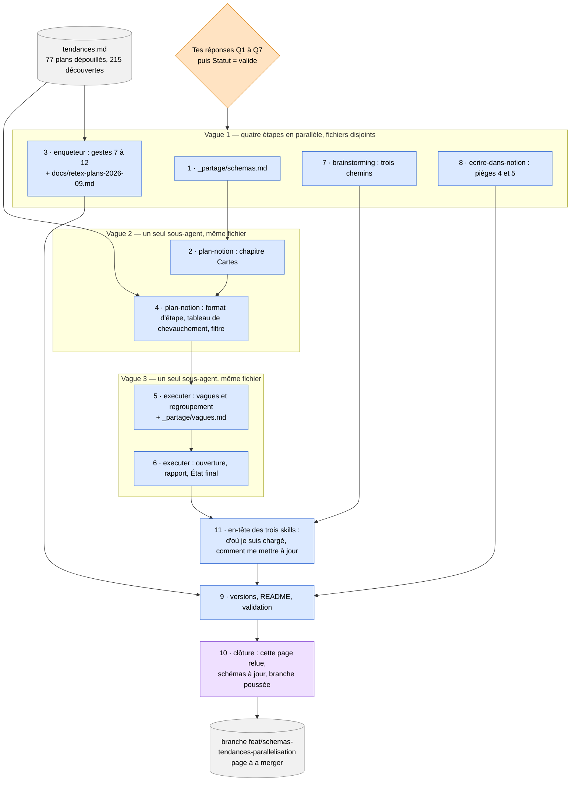

# Schémas dans une page de plan Notion

Fichier **partagé**, lu par `plan-notion` avant de poser le moindre schéma dans une
page de plan, et par `executer-plan-notion` à la clôture, quand il relit les
schémas pour vérifier qu'ils sont à jour. Comme `ecrire-dans-notion.md`, il vit à
un seul endroit pour que les deux skills gardent leur taille : la règle ne se
duplique pas, elle se référence.

Il ne dit pas *comment* écrire dans Notion sans rien casser — ça, c'est
`ecrire-dans-notion.md`. Il dit *quels* schémas poser, *quand*, et avec *quel*
code couleur.

## Pourquoi des schémas

Deux faits, remontés par l'enquête sur les plans passés :

- **Zéro bloc Mermaid sur 77 plans terminés.** Aucun plan écrit jusqu'ici n'a
  jamais posé de schéma. Toute l'information de dépendance entre étapes vivait en
  prose, dispersée dans le chapitre `Exécution`.
- **Deux familles de découvertes faites seulement à l'exécution, pas à l'écriture
  du plan**, et qui **auraient sauté aux yeux sur un schéma** : des fichiers
  partagés entre deux étapes non consécutives (donc une dépendance invisible dans
  une liste séquentielle), et des chaînes d'étapes qui se contredisent (l'étape 5
  défait une hypothèse posée par l'étape 2, par exemple). Un texte linéaire cache
  ces deux formes ; un graphe les rend visibles avant de coder.

Le schéma n'est donc pas de la décoration : c'est un outil de relecture, pour
Benjamin comme pour la session qui exécute.

## Les trois schémas, et quand chacun se justifie

### La carte du dépôt

Une vue d'ensemble du dépôt travaillé, postée dans le chapitre `Cartes` en tête de
la page de plan. Deux façons de l'obtenir, jamais un mélange :

- **Engendrée**, quand le dépôt a un générateur de carte. Exemple vérifié :
  Vahiny, où `npm run archi` produit `docs/architecture.md` depuis un registre de
  blocs déclaré dans `scripts/archi.mjs`. Une carte engendrée est reproductible et
  ne ment jamais sur la structure actuelle du code — elle se recopie telle quelle.
- **Dessinée à la main**, quand le dépôt n'a pas ce générateur. Alors, pendant
  l'enquête (pas après coup) : dix blocs au plus, construits depuis le `CLAUDE.md`
  du dépôt et la fiche rendue par l'agent `enqueteur`, jamais par lecture
  exhaustive du code. La légende porte toujours la mention *« dessinée à la main
  le AAAA-MM-JJ, non garantie par un test »* — elle dit au lecteur que rien ne
  vérifie que ce schéma suit encore le code demain. Dans ce cas, le chapitre
  `La suite` du plan note qu'une carte engendrée manque : c'est une dette, pas un
  détail, et elle doit rester visible après la clôture du plan.

Ne jamais dessiner à la main un dépôt qui a un générateur : la carte à la main
serait périmée dès le premier commit qui la contredit, sans que rien ne le signale.

### Le plan en un schéma

Un schéma unique pour toute la page de plan, une boîte par étape, qui répond à la
question que la prose linéaire pose mal : *qu'est-ce qui peut tourner en même
temps, et qu'est-ce qui attend quoi ?*

- Les **vagues** — groupes d'étapes qui peuvent s'exécuter en parallèle parce
  qu'elles ne partagent ni fichier ni dépendance — sont des sous-graphes
  (`subgraph`), pas de simples couleurs : la frontière visuelle dit d'un coup
  d'œil ce qui peut partir ensemble.
- Chaque boîte porte le code couleur (section suivante).
- Les **flèches pointillées** marquent ce qui attend un geste de Benjamin (une
  réponse, une validation, une PR) — elles se distinguent des flèches pleines, qui
  marquent une dépendance entre étapes.

Voir l'exemple complet en fin de fichier : c'est un schéma réel, déjà rendu par
Notion.

### Le sous-schéma focalisé, sous une étape

Un schéma zoomé sur les blocs du dépôt que touche une étape précise, posé sous le
H3 de cette étape dans le chapitre `Exécution`. **Seulement quand le dépôt a un
générateur** — jamais dessiné à la main, parce qu'un sous-schéma à la main double
le risque de péremption de la carte globale sans rien apporter de plus.

Exemple vérifié, Vahiny : `node scripts/archi.mjs --blocs <ids>` rend les blocs
demandés **plus leurs voisins directs, à un cran** — jamais la fermeture
transitive. C'est une vue locale, pas une deuxième carte du dépôt : elle répond à
« qu'y a-t-il juste à côté de ce que je modifie », pas à « quel est l'impact total
en cascade ».

## La ligne « Blocs touchés »

Sous chaque étape du chapitre `Exécution`, une ligne :

```
**Blocs touchés** — bloc-a, bloc-b
```

qui renvoie aux nœuds de la carte du dépôt (engendrée ou à la main). Elle relie
l'étape à un endroit précis du schéma en tête de page, sans obliger à redessiner
quoi que ce soit à chaque étape : la carte reste unique, les étapes la référencent.

## Le code couleur

Cinq classes Mermaid (`classDef`), toujours les mêmes noms et les mêmes couleurs
d'un plan à l'autre, pour que la lecture ne réapprenne pas une légende à chaque
page :

| Classe | Sens | Couleur | Déclaration |
|---|---|---|---|
| `det` | écriture déterministe, ou sous-agent | bleu | `fill:#dbe9ff,stroke:#3b6fd6,color:#000` |
| `agent` | lecture et jugement en session de pilotage | violet | `fill:#efe0ff,stroke:#8b4fd6,color:#000` |
| `toi` | un geste de Benjamin | orange | `fill:#ffe3c2,stroke:#e08a1e,color:#000` |
| `data` | un artefact (fichier, branche, page) | gris | `fill:#f1f1f1,stroke:#888,color:#000` |
| `out` | une sortie livrée | vert | `fill:#dff5e1,stroke:#2e8b57,color:#000` |

`color:#000` est systématique sur les cinq classes : sans lui, le texte hérite du
thème du lecteur et devient illisible en thème sombre sur un fond clair.

## Mettre à jour à chaque passe

Toute passe qui touche le chapitre `Exécution` (nouvelle étape, étape reformulée,
dépendance changée) **rejoue le schéma « le plan en un schéma »** — il ne survit
pas tel quel à une réorganisation des étapes, sous peine de mentir sur l'ordre
réel du travail.

**Contrôle mécanique avant de clore la passe** : compter les nœuds d'étape du
schéma et les comparer au nombre de titres H3 `Étape N` de la page. Les deux
comptes doivent être égaux. Un écart dit qu'une étape a été ajoutée, retirée ou
fusionnée dans un des deux endroits sans l'autre — c'est le même principe que le
recomptage des cases cochées d'`ecrire-dans-notion.md` : un contrôle qui ne coûte
rien et qui attrape l'oubli le plus fréquent.

## Les pièges Notion, propres aux schémas

- **Insertion sur une frontière de bloc.** Un bloc Mermaid est un bloc à part
  entière : l'insérer au milieu d'un autre bloc (par exemple entre deux lignes
  d'une liste) le casse silencieusement. Toujours l'insérer entre deux blocs
  existants, jamais à l'intérieur d'un.
- **Guillemets doubles autour des libellés à caractères spéciaux.** Un libellé de
  nœud contenant `:`, `(`, `)`, une virgule ou un retour à la ligne doit être
  entouré de guillemets doubles (`A["texte : précis"]`) — sans eux, Mermaid coupe
  le libellé au premier caractère spécial et le schéma ne compile pas.
- **`<br>` pour les retours à la ligne dans un libellé.** Un saut de ligne littéral
  dans un libellé casse le graphe ; `<br>` est le seul séparateur qui fonctionne à
  l'intérieur d'un nœud.
- **Un bloc Mermaid est un bloc de code : le bleu des retouches ne s'y applique
  pas.** La règle du bleu (`ecrire-dans-notion.md`) marque ce qui a changé à la
  dernière passe, mais un bloc de code ne prend pas la coloration en ligne de
  Notion. C'est **la légende juste au-dessus du schéma** qui porte le bleu quand
  le schéma a changé — jamais le bloc Mermaid lui-même.

## Exemple : le plan en un schéma

Rendu par Notion le 2026-09-07 (vérifié : Notion affiche un bloc ```mermaid``` comme
un diagramme, pas comme du texte). Cet exemple est la carte de la page de plan qui
a produit cette étape-ci — reprise ici telle quelle, comme preuve qu'elle passe :


